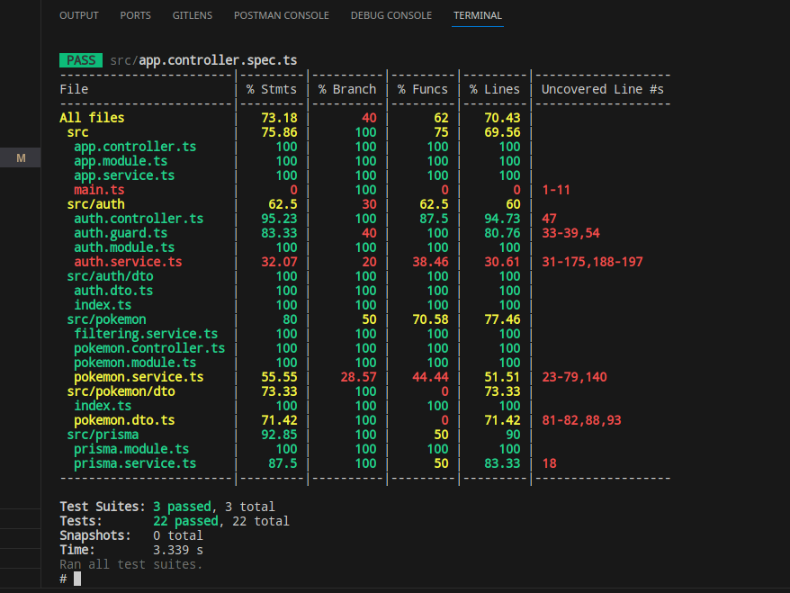
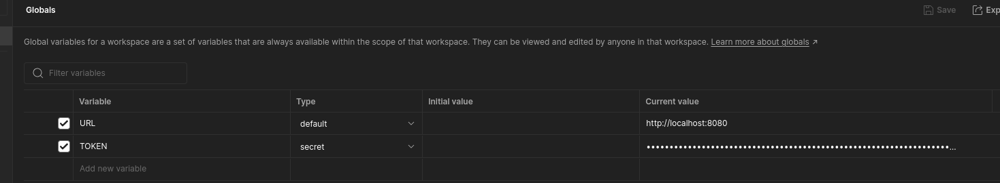

# pokemon go 

## Description

This is a simple pokemon go api that allows you to create a user, login, and add pokemon to your collection.

## tools and technologies used

+ [nodejs](https://nodejs.org/en/)
+ [typescript](https://www.typescriptlang.org/)
+ [express](https://expressjs.com/)
+ [nestjs](https://nestjs.com/)
+ [prisma](https://www.prisma.io/)
+ [postgres](https://www.postgresql.org/)
+ [docker](https://www.docker.com/)
+ [jest](https://jestjs.io/) 

## setup

1. Clone this repo

2. run `docker-compose up` in the root directory

## seeded data 

+ there is a user with the email `admin@admin.com` and password `admin1234` that is an admin user

+ there is about 800 pokemon in the database (same as in the excel sheet provided)

## tests and test coverage 

+ to run the tests you cna run this command `docker-compose exec app sh` then `npm run test:cov`

## postman collection

+ [postman collection](https://www.postman.com/dark-flare-638246/workspace/pokemon-go)

**note** go to the environment and set the URL variable to `http://localhost:8080/api/v1`

**note** you will need to create a user and login to get a TOKEN to use the other routes

the token will be assigned to the `token` variable in the environment automatically when you login

## routes

### auth routes

+ POST /auth/signup 
    + body: { username: string, password: string }
    + response: { token: string }

+ POST /auth/login
    + body: { username: string, password: string }
    + response: { token: string }

### pokemon routes
**note** you should be authenticated to view the pokemon routes but only admin users can add, update, and delete pokemon

+ GET /pokemon
    + response: { pokemon: Pokemon[] }

+ POST /pokemon/add
    + body: { name: string, type: string }
    + response: { pokemon: Pokemon }

+ GET /pokemon/:id
    + response: { pokemon: Pokemon }

**note** these rest of the endpoints  require you to be logged in as an admin user to use them

+ DELETE /pokemon/:id   (admin only)
    + response: { pokemon: Pokemon }

+ PUT /pokemon/:id  (admin only)
    + body: { name: string, type: string }
    + response: { pokemon: Pokemon }

### user routes
**note** you will need to create a user and login to get a TOKEN to use  them 

+ GET /user
    + response: { user: User }

+ PATCH /user
    + body: { name: string, email: string }
    + response: { user: User }

+ DELETE /user
    + response: { user: User }

+ PATCH /user/change-password
    + body: { password: string }
    + response: { user: User }

